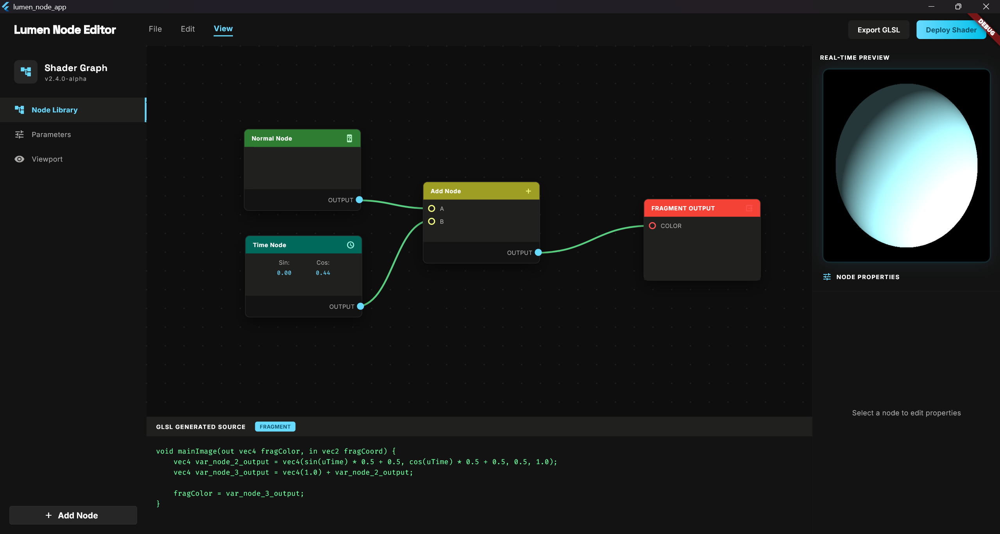

# 🌌 Lumen Node Editor

**Lumen Node** is a visual shader editor built with **Flutter** and a custom rendering engine powered by **C++20** and **OpenGL**. It allows you to procedurally generate GLSL code in real-time using a node-based system and immediately preview the results on an illuminated 3D model.



## ✨ Key Features

* 🎨 **Visual Programming:** Create complex materials without writing a single line of code using a robust node system.
* ⚡ **Real-time Code Generation:** The engine automatically traverses the node graph and compiles an optimized fragment GLSL shader on the fly.
* 🌍 **3D Preview:** A built-in OpenGL renderer projects the generated shader onto a 3D sphere, complete with diffuse lighting and shading calculations.
* 🧠 **Smart Render Loop:** Energy-efficient rendering cycle. The engine renders the scene at 60 FPS *only* when an active `TimeNode` is present in the graph. For static scenes, GPU overhead drops to zero.
* 🔌 **Native Integration:** Seamless communication between the Dart UI and the C++ core via Flutter Platform Channels and a hidden FBO (Framebuffer Object).

## 🛠 Tech Stack

**Frontend (UI & State):**
* [Flutter](https://flutter.dev/) (Desktop Windows)
* [Riverpod](https://riverpod.dev/) — Reactive state management and Dependency Injection.
* [FFI](https://en.wikipedia.org/wiki/Foreign_function_interface) - For interaction between UI and backend sides

**Backend (Rendering Engine):**
* **C++20**
* **OpenGL 3.3 Core Profile** — Graphics API.
* **GLFW & GLEW** — Hidden context creation and extension loading.
* **GLM** — Vector and matrix mathematics (MVP matrices).
* **stb_image** — Loading and processing user-imported textures.

## 🚀 Installation & Setup (Windows)

### Prerequisites
* Flutter SDK (with Windows desktop support enabled)
* Visual Studio 2022 (with "Desktop development with C++" workload)
* [vcpkg](https://vcpkg.io/) (C++ package manager)
* CMake, make

### Instructions

1. **Clone the repository:**
   ```bash
   git clone https://github.com/groovyshark/lumen-node.git
   cd lumen-node
   ```

2. **Install C++ dependencies via vcpkg.** 

    Ensure vcpkg is integrated with Visual Studio (vcpkg integrate install), then run:

    ```bash
    vcpkg install glew:x64-windows glfw3:x64-windows glm:x64-windows stb:x64-windows
    ```

3. **Build the C++ Core Engine (Lumen DLL).**

    The rendering engine is a standalone C++ library and must be built before running the Flutter app. Navigate to the engine directory and build it using CMake:

    ```bash
    # Navigate to your C++ engine folder
    mkdir build
    cd build

    # Configure and build the project (adjust the vcpkg path as needed)
    cmake .. -DCMAKE_TOOLCHAIN_FILE="C:/path/to/vcpkg/scripts/buildsystems/vcpkg.cmake"
    cmake --build . --config Debug
    ```


4. **Build and run the application.**

    Navigate to the `app` folder (or your Flutter project root) and run the Windows build.

    ```bash
    cd ../app
    make
    make run
    ```


## 🏗 Architecture Overview
The project is divided into three primary layers:

1. **Dart UI:** The interactive canvas containing nodes, gesture management, zooming, and connections (Bezier curves).

2. **State & Transport:** Riverpod providers trigger the C++ core to recompile the node tree into a GLSL string and transmit it via MethodChannel.

3. **C++ Lumen Engine:** Receives the GLSL string, dynamically links it with the vertex shader, renders the frame into a hidden texture (FBO), and returns the memory pointer back to Flutter to be displayed in a Texture widget.

## 🗺 Roadmap
- [ ] Implement Zero-Copy Rendering (via `WGL_NV_DX_interop`) for direct texture sharing between OpenGL and DirectX, eliminating CPU pixel copying.

- [ ] Support for importing custom 3D models (`OBJ/FBX`).

- [ ] Export generated GLSL to a `.glsl` file.

- [ ] Additional Math nodes (Sin, Cos, Smoothstep, Mix).


## 👨‍💻 Author
**Vyacheslav** — Game Developer / Software Engineer

* GitHub: `@groovyshark`

#
*Built with ❤️ and a whole lot of C++ linkers.*
